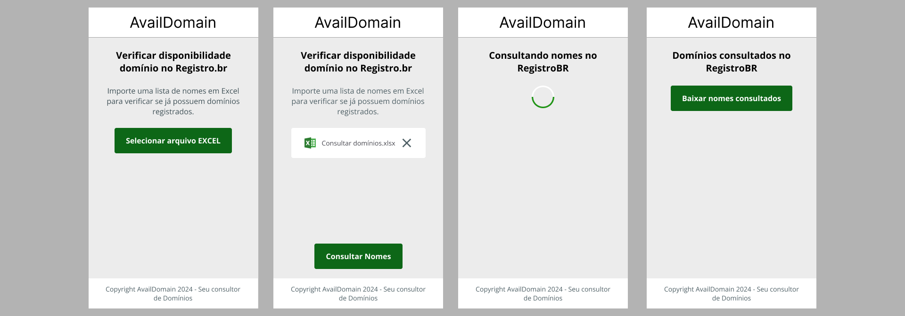
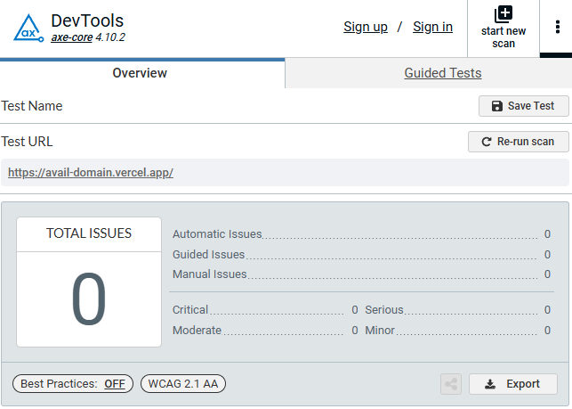

<div align="center">

<h1>Avail Domain</h1>

<p align="center">
	<strong>
		Maneira simples e rápida de consultar em lote disponilidade de domínios no RegistroBR.
	</strong>
</p>

<h4 align="center">
	🚧  Status: 🚀 Em desenvolvimento...  🚧
</h4>

[English](./README.md) •
[Layout](#layout) •
[Tecnologias](#tecnologias) •
[Acessibilidade](#acessibilidade) •
[Docker](#-desenvolver-com-docker) •
[Executar Local](#executar-local)


</div>

## Layout
<div align="center">
	
</div>

## Tecnologias
- [Next.js](https://nextjs.org/) - Framework React
- [React](https://react.dev/)
- [Typescript](https://www.typescriptlang.org/)
- [Sass](https://sass-lang.com/) - Estilos
- [Zustand](https://zustand.docs.pmnd.rs/getting-started/introduction) - Gereciador de estados React
- [Sheetjs](https://sheetjs.com/) - Manipular planilhas
- [nanoid](https://www.npmjs.com/package/nanoid) - Gerador de ID Único
- [Jest](https://jestjs.io/) - Testes
- [ESlint](https://eslint.org/) - Linter
- [Prettier](https://prettier.io/) - Formatar Código
- [husky](https://typicode.github.io/husky/) - GitHooks
- [commitlint](https://commitlint.js.org/) - Formatar Commits

## Acessibilidade

### axe DevTools - Teste de acessibilidade da Web



## 💻 Desenvolver com [Docker](https://docs.docker.com/engine/install/)

`./dev` permite que você execute rapidamente um servidor de desenvolvimento e rode comandos dentro do contêiner Docker.

#### Iniciar o servidor de desenvolvimento
```bash
./dev start
```
Abrir [http://localhost:3001](http://localhost:3001)

#### Parar o servidor de desenvolvimento
```bash
./dev stop
```

#### Para mais informações
```bash
./dev
```

#### Alias
Para faciltar a execução de comandos, você pode adicionar o seguinte alias ao seu `~/.bashrc`, `~/.profile`, ou `~/.zshrc` arquivo.

```bash
alias dev='./dev'
```

## Executar Local

Esse é um projeto [Next.js](https://nextjs.org/) criado com [`create-next-app`](https://github.com/vercel/next.js/tree/canary/packages/create-next-app).

Primeiro, execute o servidor de desenvolvimento:

```bash
npm run dev
# or
yarn dev
# or
pnpm dev
# or
bun dev
```

Abrir [http://localhost:3000](http://localhost:3000) com seu navegador para ver o resultado.

## Deploy na Vercel

A maneira mais fácil de implantar seu aplicativo Next.js é usar a [Plataforma Vercel](https://vercel.com/new?utm_medium=default-template&filter=next.js&utm_source=create-next-app&utm_campaign=create-next-app-readme) dos criadores do Next.js;

Confira nossa [documentação de implantação do Next.js](https://nextjs.org/docs/deployment) para mais detalhes.

---
<a target="_blank" href="https://icons8.com/icon/13654/microsoft-excel">Ícones Excel</a> por <a target="_blank" href="https://icons8.com">Icons8.</a>

<a target="_blank" href="https://icons8.com/icon/8112/close">Ícones Fechar</a> por <a target="_blank" href="https://icons8.com">Icons8.</a>
