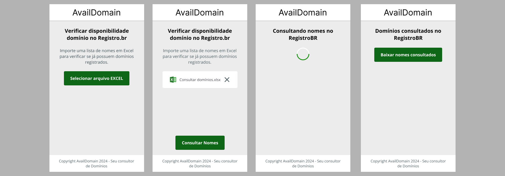

<div align="center">

<h1>Avail Domain</h1>

<p>
	<strong>
		Simple and quick way to batch check domain availability at RegistroBR.
	</strong>
</p>

<h4 align="center">
	🚧  Status: 🚀 In progress...  🚧
</h4>

[Português](./README-pt-BR.md) •
[Layout](#layout) •
[Technologies](#technologies) •
[Accessibility](#accessibility) •
[Docker](#-development-with-docker) •
[Running Locally](#running-locally)

</div>

## Layout
<div align="center">
	
</div>

## Technologies
- [Next.js](https://nextjs.org/) - React Framework
- [React](https://react.dev/)
- [Typescript](https://www.typescriptlang.org/)
- [Sass](https://sass-lang.com/) - Styles
- [Zustand](https://zustand.docs.pmnd.rs/getting-started/introduction) - React State Manager
- [Sheetjs](https://sheetjs.com/) - Handle Spreadsheets
- [Jest](https://jestjs.io/) - Test
- [ESlint](https://eslint.org/) - Linter
- [Prettier](https://prettier.io/) - Code Formatter
- [Husky](https://typicode.github.io/husky/) - GitHooks
- [commitlint](https://commitlint.js.org/) - Lint Commit Messages

## Accessibility

### axe DevTools - Web Accessibility Testing


## 💻 Development with [Docker](https://docs.docker.com/engine/install/)

`./dev` allows you to quickly run a development server and execute commands inside Docker container.

#### Start the development server
```bash
./dev start
```
Open [http://localhost:3001](http://localhost:3001)

#### Stop the development server
```bash
./dev stop
```

#### For more information
```bash
./dev
```

#### Alias
To make it easier to run the commands, you can add the following alias to your `~/.bashrc`, `~/.profile`, or `~/.zshrc` file.

```bash
alias dev='./dev'
```

## Running Locally

This is a [Next.js](https://nextjs.org/) project bootstrapped with [`create-next-app`](https://github.com/vercel/next.js/tree/canary/packages/create-next-app).

First, run the development server:

```bash
npm run dev
# or
yarn dev
# or
pnpm dev
# or
bun dev
```

Open [http://localhost:3000](http://localhost:3000) with your browser to see the result.

## Deploy on Vercel

The easiest way to deploy your Next.js app is to use the [Vercel Platform](https://vercel.com/new?utm_medium=default-template&filter=next.js&utm_source=create-next-app&utm_campaign=create-next-app-readme) from the creators of Next.js.

Check out our [Next.js deployment documentation](https://nextjs.org/docs/deployment) for more details.

---
<a target="_blank" href="https://icons8.com/icon/13654/microsoft-excel">Excel</a> Icons by <a target="_blank" href="https://icons8.com">Icons8</a>

<a target="_blank" href="https://icons8.com/icon/8112/close">Close</a> Icons by <a target="_blank" href="https://icons8.com">Icons8</a>
